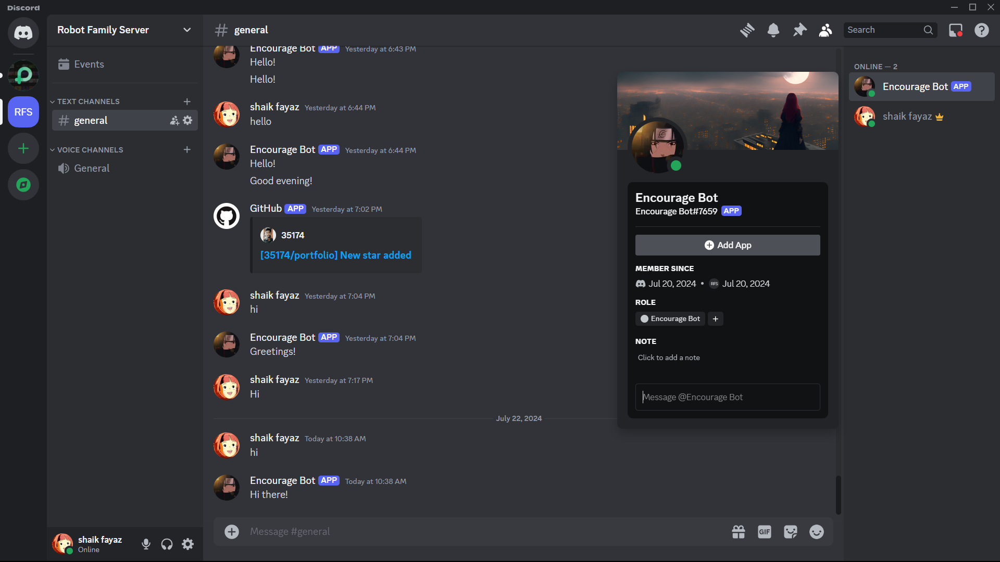

# Discord-Bot

This is a basic Discord bot using python and also flask.
I had also added webhook of one of my github repository.
I had used uptimeRobot web site to make my bot available for 24/7

you can check the code I had used Replit and i also recommend you to use Replit so that it provides .env file 

NOTE:Dont use this .env file you have to generate your token of your Bot.
